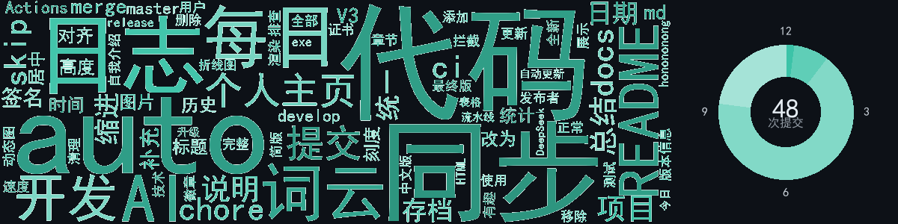

<h1 style="color:#4ec9b0">2026年8月17日日志</h1>

　　今天上午先自动化提交了三次开发日志，下午集中把微信公众号OCR采集器收尾：更新了用户版README并加上自签名说明，随后发布V3.0.1版本并给exe补全版本信息，合并分支后清理了文档。接着大半天投入到个人主页建设中，重写中文版介绍，并用GitHub Actions配合DeepSeek实现了每日提交折线图自动更新。之后给多个订单类项目（电商爬虫、数据清洗、评论采集等）配置了同步流水线，跑了一大批auto同步。傍晚把个人主页升级成每日日志系统——用AI总结当天提交、生成词云和环形时间图，还反复调整了布局、配色和刻度样式，最后决定历史存档按日期分文件夹保存。今天主要是打磨自动化展示和个人品牌页面，尤其在图表布局上花了不少功夫。

📚 [查看历史日志](./logs/)