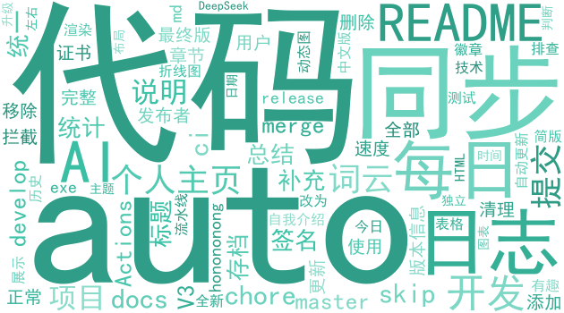

<h1 style="color:#4ec9b0">2026年8月17日日志</h1>

今天早晨先处理了微信公众号OCR采集器的收尾工作，把README重新打磨了一遍，补上了发布者签名的说明，毕竟自签名证书在用户那边会触发拦截提示，提前写清楚能少很多困扰。随后发布了V3.0.1版本，给exe补全了版本信息，合并分支后觉得文档里证书章节有点多余，干脆删掉保持清爽。

下午把精力转回个人主页，这玩意儿改了一下午。最开始想放统计卡和徽章，结果渲染老出问题，干脆推倒重来，写了个更有趣的中文版，还加了每日提交动态图。后来觉得光展示不够，直接让AI来总结我的开发日志，配上词云和饼图，颜色也让AI每天根据心情定。折腾到傍晚，终于把日志升级成带日期标题、AI写百字总结、左右布局带独立图表的完整体，词云和饼图的比例也调顺眼了好几个版本。

晚上顺手把十几个项目仓库同步了一遍，都是些爬虫和数据处理的活儿，确保代码在各处保持一致。整体节奏紧凑但挺充实，从文档到工具链再到自动化流水线，每样都往前推了一点。

 

📚 [查看历史日志](./logs/)