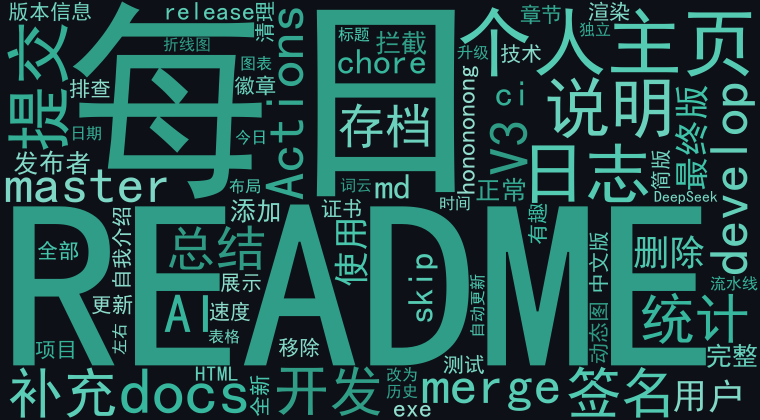
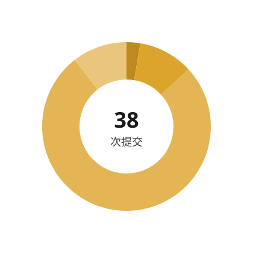

<h1 style="color:#4ec9b0">2026年8月17日日志</h1>

把wechat-article-collector打磨到V3.0.1，给exe补全了版本信息，又花了些心思把README从用户视角重写干净，删掉冗余章节。下午一头扎进个人主页，折腾出带每日提交折线图的版本，后来索性升级成自动日志系统，接上DeepSeek做AI总结，配上词云和时间饼图，看着提交数据变成可视化图表，还挺有成就感。

 

📚 [查看历史日志](./logs/)