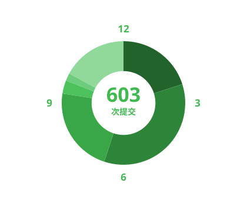

<h1 style="color:#39c5cf">2026年8月17日日志</h1>

　　上午补了三次开发日志，纯粹是维护习惯。中午把微信公众号OCR采集器收尾了，README重写为面向用户的最终版，顺手删了多余说明文档。发布V3.0.1时给exe补全了版本信息，但发现自签名证书（honononong）可能触发拦截，特意在文档里加了提醒。合并分支后清理了过时的证书章节。下午开始折腾个人主页，试了几版——先是最简README排查渲染问题，再逐步加回徽章。后来干脆推倒重来，写了个有趣的中文版主页，还接上了每日提交动态图。为了这图，特意配了Actions流水线自动更新。到晚上，发现动态图还不够，干脆升级成完整日志系统：让AI用DeepSeek总结当日提交，生成词云、时间饼图、玫瑰图，还让AI根据内容挑主题色统一全篇。折腾了好几轮，调比例、缩进、图例、颜色深浅，最后把AI总结字数放宽到30到500字灵活处理。中间还同步了十几个order系列仓库，琐碎但都是该做的。

 &nbsp; 

📚 [查看历史日志](./logs/)